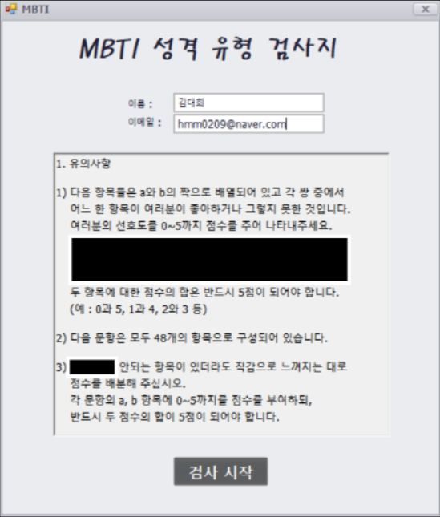
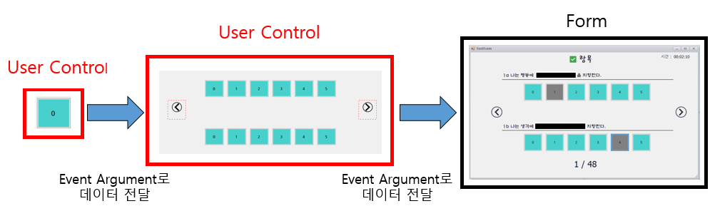
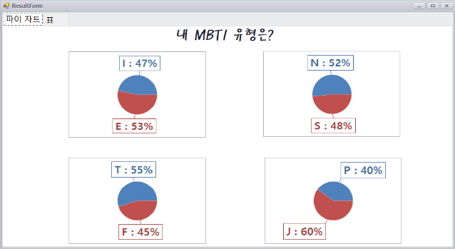

# 개요

MBTI는 나에 대해 더 잘 알고 싶어 하는 밀레니얼, Z 세대의 성향과 만나 하나의 트렌드로 떠오르고 있습니다.
저희도 재미로 하는 성격 검사에 흥미가 있어서 이 프로그램을 만들게 되었습니다. MBTI를 실제로 검사할 수 있도록 구현했고 만 번의 시뮬레이션을 통해 16개 성격이 어떻게 분포되는지 확인하는 프로그램입니다.

# 사용기술
## 언어
* C# 3.0+

## 프레임워크
* .NetFramework
* EntityFramework
* Winform

## 데이터베이스
* MSSQL Server 2019

## Thrid Party Control
* DevExrpess Winform

# 데이터베이스 설계

* Test와 Question은 다대다 관계이기 때문에 Response 매핑 테이블을 만들었습니다.

# 설명

## 1. 구현 내용

### 1-1 StartForm

* 사용자는 이름과 이메일을 입력하면 MBTI 테스트를 시작할 수 있습니다.
검사 시작 버튼을 클릭하면 User 테이블에 이름과 이메일이 저장됩니다.

### 1-2 TestForm

* 사용자는 1 ~ 48번까지 각각 점수를 매길 수 있습니다.
사용자가 테스트를 진행하다가 이전 문제로 돌아와서 점수를 바꿀 수도 있기에 한 문제마다 Response 테이블에 점수를 저장해줬습니다.

* TestForm에서 번호를 클릭했을 때 UserControl -> UserControl -> Form으로 데이터를 전달했습니다. 
이때 이벤트를 사용해서 UserControl에서 Form으로 Event Argument에 선택한 번호를 담아서 전달했습니다.

* 48번 문항으로 가면 완료 버튼이 생기게 되고 클릭하면 검사가 완료됩니다.

### 1-3 ResultForm

* 검사가 완료되면 사용자는 4개 영역의 결과를 Pie Chart로 확인할 수 있습니다.

* 또한 TabControl을 이용하여 하나의 Form에서 2개의 페이지를 사용했습니다.
* 이 페이지는 사용자의 결과를 보다 자세히 알려줍니다.

### 1-4 SimulationResultForm

* 저희는 개별적으로 여러 번 검사해보면서 문득 10000번의 시뮬레이션을 돌리면 어떠한 결과가 나올지 궁금해졌습니다.

* 따라서 10000번의 시뮬레이션을 돌려봤습니다.

* 약 10000번 시뮬레이션의 결과가 Test 테이블에 저장된 사진입니다.

* 10000번의 시뮬레이션 결과를 쉽게 확인하기 위해서 Bar Chart를 사용했습니다.
* 결과를 확인해보니 저희 예상과는 다르게 고르게 분포되지 않았음을 알 수 있습니다.

* Pie Chart나 Bar Chart를 나타내기 위해서는 Chart Control에 배열이나 컬렉션(List) 같은 데이터를 Chart에 바인딩해주면 됩니다.

